# 系统架构与流程图

## 🏗️ 系统整体架构

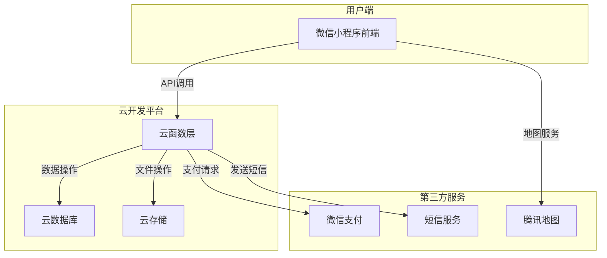

## 📊 数据库架构

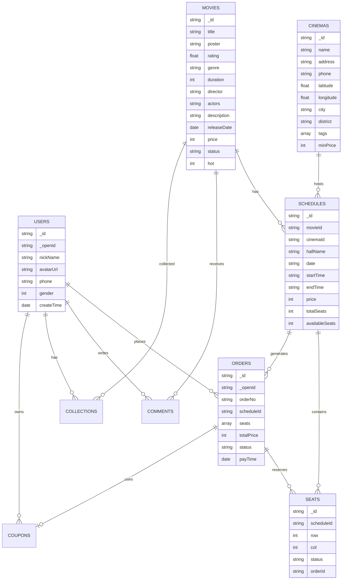

## 🔄 核心业务流程

### 1. 用户登录流程

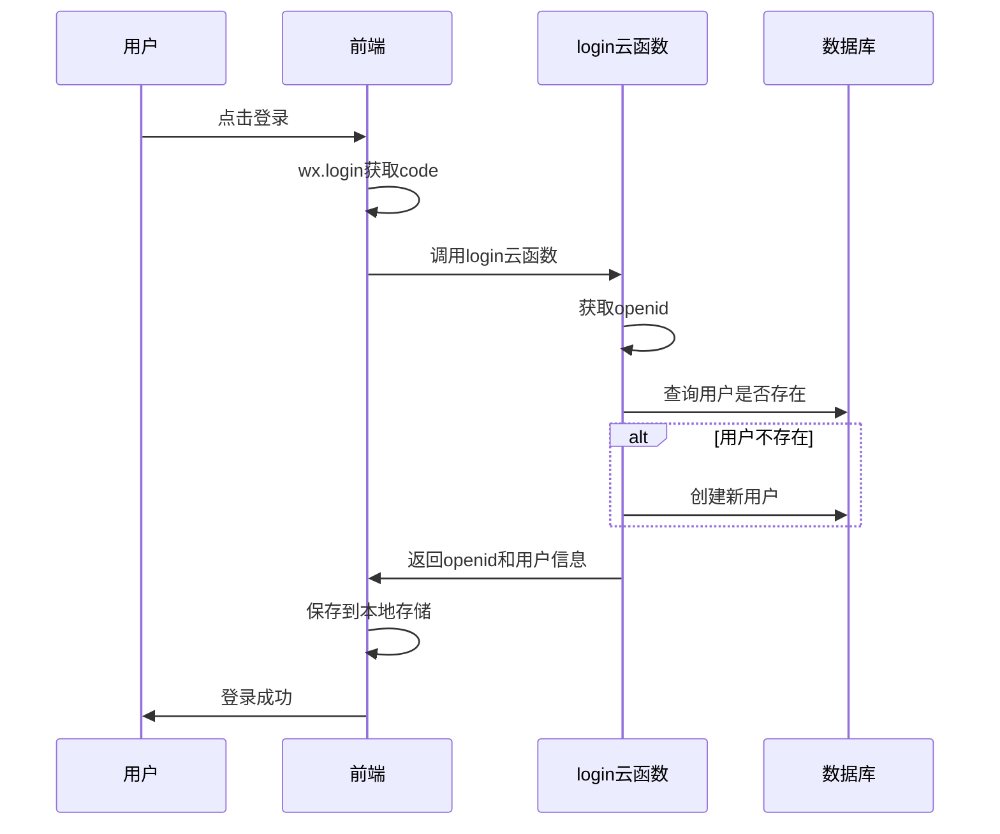

### 2. 选座购票流程

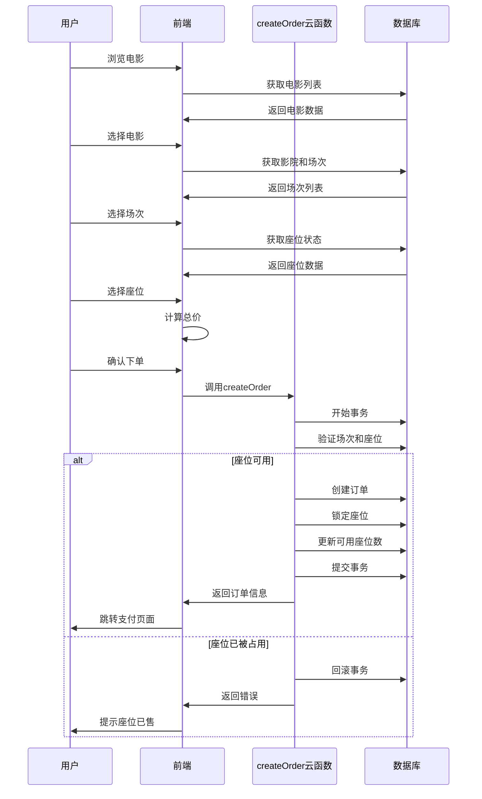

### 3. 订单支付流程

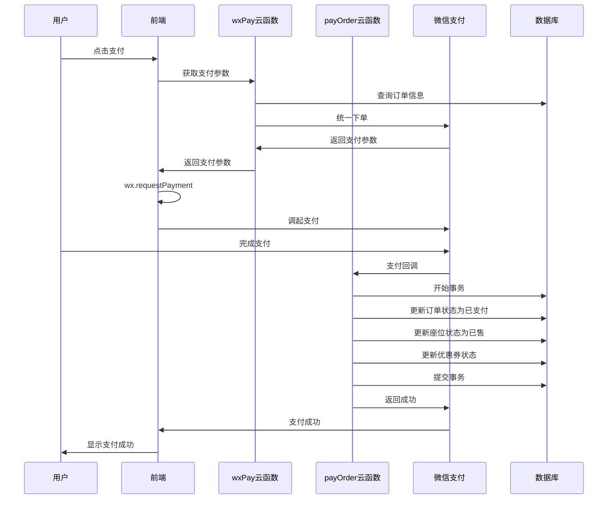

### 4. 评论功能流程

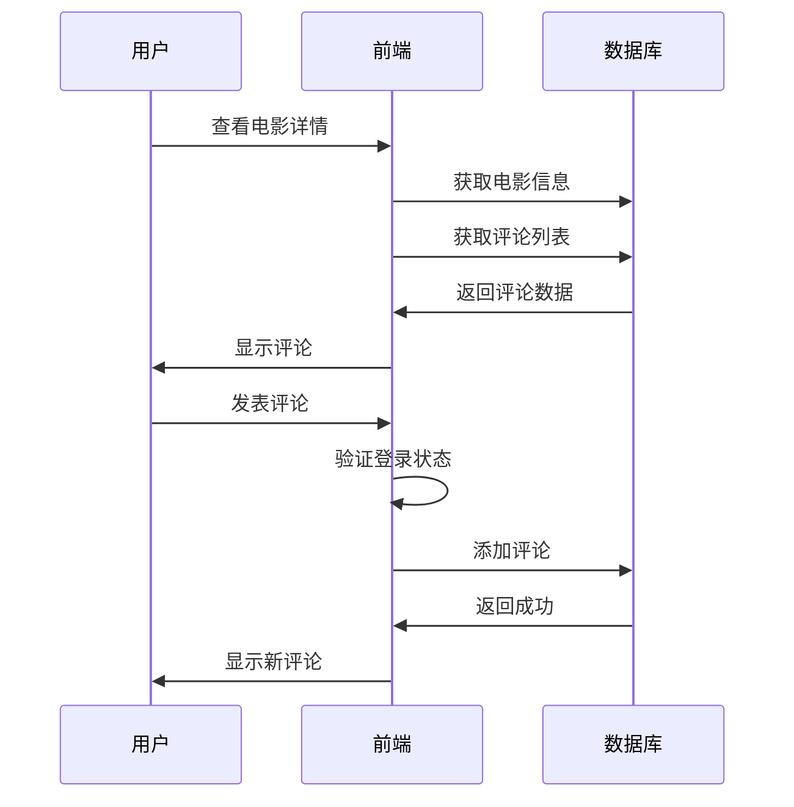

### 5. 收藏功能流程

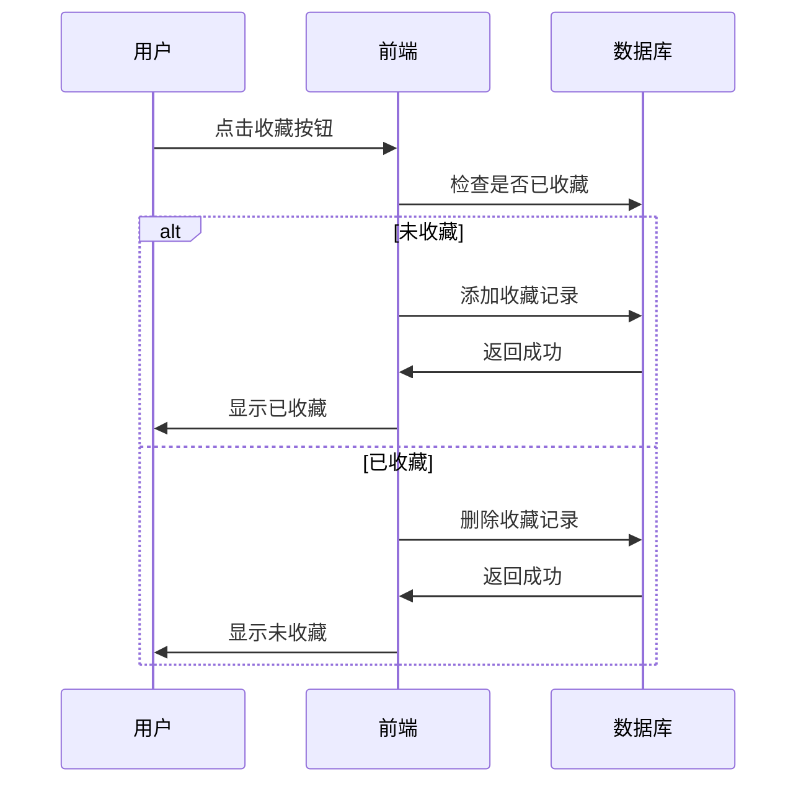

## 🎯 页面导航流程

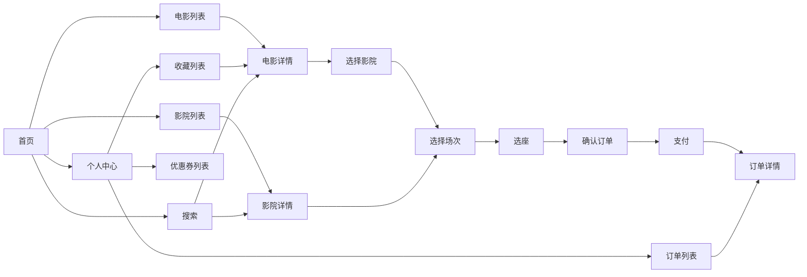

## 🔐 权限控制流程

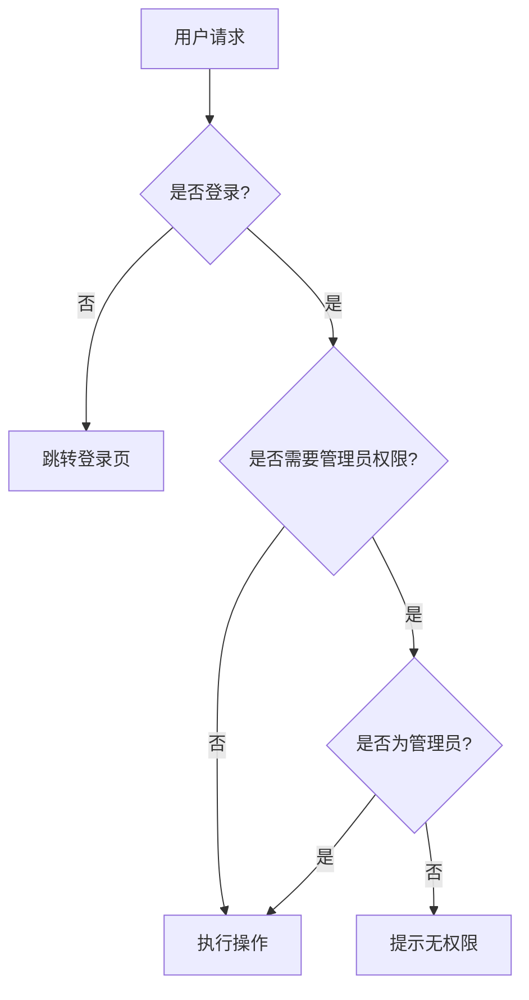

## 📱 前端页面结构

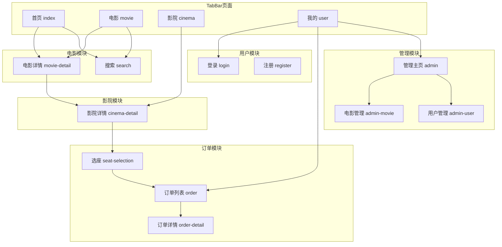

## 🛠️ 云函数架构

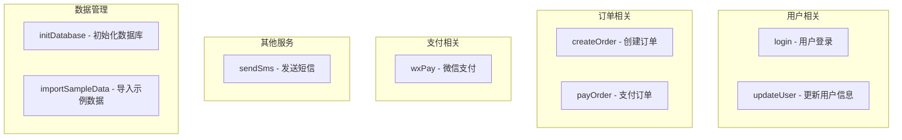

## 📈 数据流向

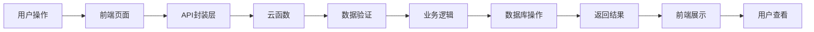

## 🔄 状态管理

### 订单状态流转

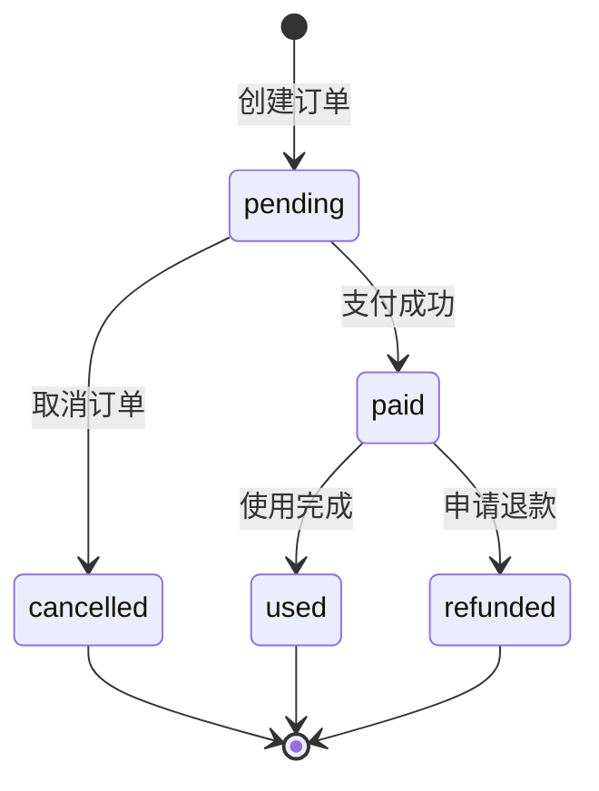

### 座位状态流转

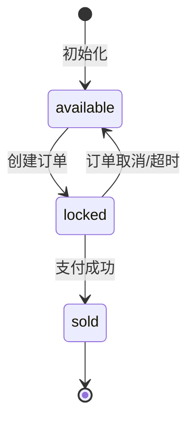

### 优惠券状态流转

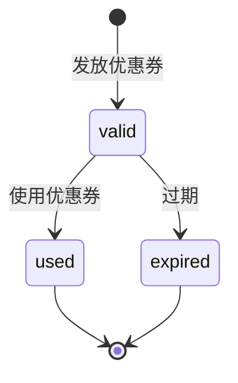

## 🎨 UI组件层次

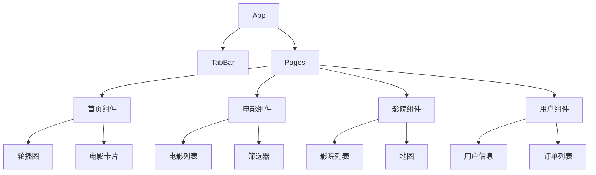

## 🔧 工具类架构

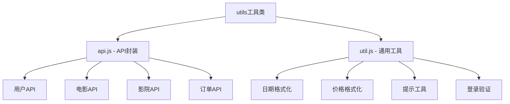

## 📊 性能优化策略

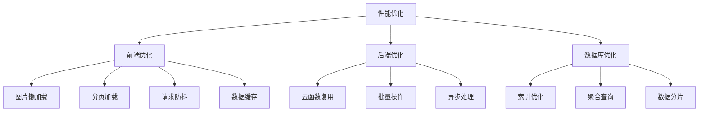

## 🔒 安全防护体系

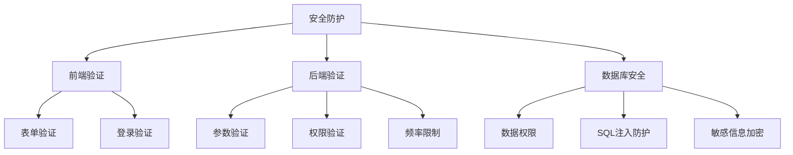

这些架构图和流程图清晰地展示了整个系统的结构和运作方式，可以作为开发过程中的重要参考文档。
